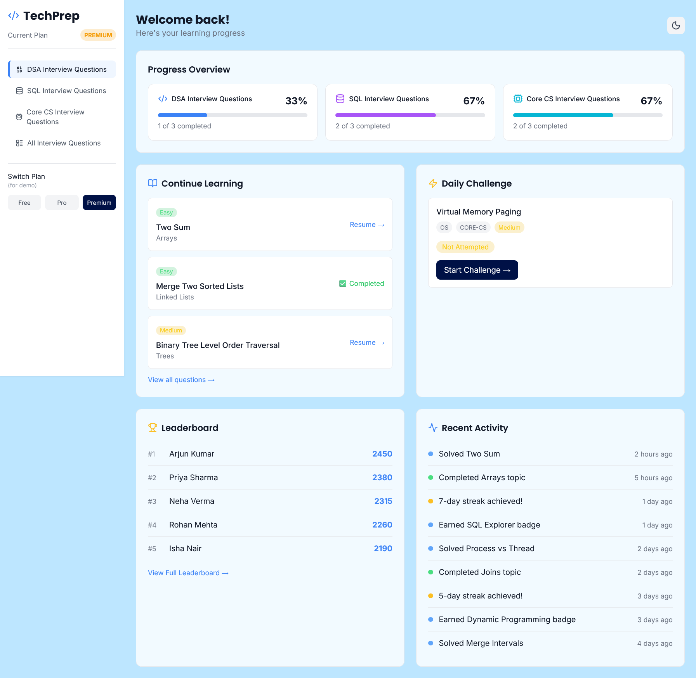

# TechPrep

A student dashboard for interview preparation. Track progress across DSA, SQL, and Core CS topics with role-based access control (Free / Pro / Premium), daily challenges, and a question detail view with hints and solutions. State persists across refreshes.



## Tech Stack

- React 18 + TypeScript
- Vite
- Tailwind CSS v3
- React Context + localStorage
- JSON Server
- Lucide React

## Design Decisions

- Color palette and visual style matched to [techlearnsolutions.com](https://techlearnsolutions.com)
- One component per responsibility — Sidebar, ProgressOverview, DailyChallenge, QuestionDetail, etc.
- Role-based access handled by a single `canAccess(plan, section)` utility — no scattered permission checks
- Data fetched from JSON Server (`db.json`), not hardcoded in components
- Question detail page with collapsible hint/solution keeps the UI clean without over-building a full code editor
- Loading skeletons and empty states for every data-driven section
- Responsive layout with collapsible sidebar on mobile

## State Management

React Context (`AppContext`) + `localStorage`. No Redux — the app has simple shared state that doesn't need reducers or middleware.

Persisted via localStorage:
- Selected plan (Free/Pro/Premium)
- Active sidebar tab
- Question progress (status, last attempted)

Context provides: plan, active tab, questions, progress stats, and actions to mark questions completed/not completed and navigate to question detail view.

## How to Run

```bash
npm install
npm run dev
```
